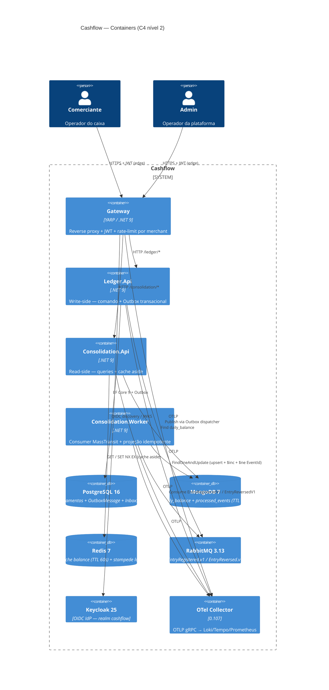

# Cashflow — Sistema de Fluxo de Caixa

> Plataforma event-driven em **.NET 9** que registra lançamentos financeiros (créditos/débitos) e mantém uma projeção diária consolidada por comerciante. Construída para sobreviver à indisponibilidade do consolidado e sustentar **50 req/s** de consulta com **< 5% de erro** (NFR literal do desafio).

[](https://github.com/marcelocamargosjr/cashflow/actions/workflows/ci.yml)
[](https://github.com/marcelocamargosjr/cashflow/actions/workflows/codeql.yml)
[](#10-como-rodar-os-testes)
[](#10-como-rodar-os-testes)
[](#11-validação-do-nfr-de-50-reqs-make-perf)
[](#12-demonstração-de-isolamento-make-chaos-validate)
[](#18-licença)

---

## 1. Visão geral

Dois bounded contexts independentes comunicando-se **apenas por eventos**:

- **Ledger** (write-side, Postgres) — fonte de verdade dos lançamentos. Cada `POST /entries` persiste a entidade **e** o evento na mesma transação via **Outbox MassTransit**. Continua aceitando lançamentos mesmo se o Consolidado estiver offline.
- **Consolidation** (read-side, MongoDB + Redis) — consumidor idempotente dos eventos. Mantém um documento na coleção `daily_balances` por `(merchantId, date)` otimizado para a query `GET /balances/{merchantId}/daily` com cache aside e stampede lock.

**Gateway YARP** termina autenticação JWT (Keycloak), aplica rate limit por merchant e roteia para os back-ends. Stack de observabilidade (OTel → Prometheus + Loki + Tempo + Grafana) emite traces ponta-a-ponta correlacionados por `correlationId`.

---

## 2. Arquitetura em uma imagem



Diagramas detalhados em [`docs/c4/`](docs/c4/) (Context, Containers, Components Ledger, Components Consolidation) e [`docs/sequence/`](docs/sequence/) (Register Entry, Query Balance, Chaos Isolation).

---

## 3. Stack tecnológica

| Camada | Tecnologia | Versão | Por quê (ADR) |
|---|---|---|---|
| Linguagem | C# / .NET | 9.0 | `Guid.CreateVersion7`, AOT-ready, rate-limit maduro — [ADR-0002](docs/adr/ADR-0002-dotnet-9-clean-arch.md) |
| Camadas | Clean Architecture + DDD-lite | — | Domain isolada + NetArchTest — [ADR-0003](docs/adr/ADR-0003-clean-architecture.md) |
| Padrão de escrita | CQRS físico | — | Postgres write × Mongo read — [ADR-0004](docs/adr/ADR-0004-cqrs-fisico.md) |
| Write DB | PostgreSQL | 16.3 | ACID + JSONB + SKIP LOCKED — [ADR-0005](docs/adr/ADR-0005-postgres-write-side.md) |
| Read DB | MongoDB | 7.0 | Documento por `(merchant, date)`, sem JOIN — [ADR-0006](docs/adr/ADR-0006-mongo-read-side.md) |
| Broker | RabbitMQ + MassTransit | 3.13 / 8.x | DX + Outbox EF nativo — [ADR-0007](docs/adr/ADR-0007-rabbitmq-vs-kafka.md) |
| Outbox | MassTransit EntityFrameworkOutbox | — | Sem dispatcher próprio (há plumbing reflexivo no bootstrap) — [ADR-0008](docs/adr/ADR-0008-masstransit-outbox.md) |
| Cache | Redis | 7.4 | TTL 60s + stampede lock — [ADR-0009](docs/adr/ADR-0009-redis-cache.md) |
| AuthN | Keycloak OIDC | 25.0 | Realm importável, `merchantId` claim — [ADR-0011](docs/adr/ADR-0011-keycloak-auth.md) |
| Gateway | YARP | 2.x | .NET nativo, JWT + rate-limit + transforms — [ADR-0012](docs/adr/ADR-0012-yarp-gateway.md) |
| Observabilidade | OTel + Grafana stack | — | Vendor-neutral, correlação OOTB — [ADR-0010](docs/adr/ADR-0010-otel-observability.md) |
| Testes | xUnit + Testcontainers + NetArchTest + k6 | — | Pirâmide completa — [ADR-0013](docs/adr/ADR-0013-test-strategy.md) |

---

## 4. Pré-requisitos

Apenas três dependências locais — **nenhuma instalação de .NET / Node / Postgres / Mongo é necessária**.

| Ferramenta | Versão mínima | Verificação |
|---|---|---|
| Docker Engine | 24.x | `docker --version` |
| Docker Compose | v2 (plugin) | `docker compose version` |
| Git | 2.40+ | `git --version` |
| GNU Make | 4.x (Linux/macOS/WSL) | `make --version` |

> **Windows nativo:** `scripts/make-up.ps1` é compatível com **Windows PowerShell 5.1 e PowerShell 7+**. O wrapper checa `$LASTEXITCODE` em cada chamada `docker` e não redireciona stderr — assim a stderr de `docker pull` (linhas de progresso) não vira `NativeCommandError` em PS 5.1. Para `make-perf.sh` em Git Bash, o script já define `MSYS_NO_PATHCONV=1` / `MSYS2_ARG_CONV_EXCL='*'` para impedir conversão de paths.
> **CPU/RAM recomendados:** 4 vCPUs / 8 GB RAM (stack completa com observabilidade).

---

## 5. Como rodar

```bash
git clone <repo-url> cashflow && cd cashflow
cp infra/.env.example infra/.env       # CHANGE_ME_IN_PROD em todos os secrets
make up                                # core + app: 15 containers, ~90s para healthy
```

`make up` levanta:

- **core** (10): Postgres, Mongo, Rabbit, Redis, Keycloak, OTel-Collector, Prometheus, Loki, Tempo, Grafana.
- **app** (5): Gateway, Ledger.Api, Consolidation.Api, Consolidation.Worker, Frontend Next.js.

Para popular dados (após `make up`):

```bash
# Bash / WSL / Git Bash — Makefile (exige TOKEN no env):
TOKEN=$(curl -fsS -X POST http://localhost:8080/realms/cashflow/protocol/openid-connect/token \
  -H 'Content-Type: application/x-www-form-urlencoded' \
  -d 'grant_type=password&client_id=cashflow-api&client_secret=cashflow-api-secret&username=admin@cashflow.local&password=admin123&scope=openid' \
  | jq -r .access_token) make seed

# PowerShell — wrapper já obtém token admin automaticamente:
./scripts/make-up.ps1 seed             # default: 30 dias x 20 entries
./scripts/make-up.ps1 seed 7 50        # 7 dias x 50 entries por dia
```

O seeder usa Bogus para gerar lançamentos sintéticos (Credit/Debit, categorias variadas, descrições, valores aleatórios fixos por semente) e os passa pelo mesmo `RegisterEntryCommand` que o endpoint público — então o fluxo Outbox/RabbitMQ/Consolidation processa exatamente como em produção.

Outros alvos: `make down` (stop), `make nuke` (apaga volumes), `make logs SERVICE=ledger-api`, `make test`, `make perf`, `make chaos-validate`, `make build`.

---

## 6. URLs e credenciais default (dev)

| Serviço | URL | Credenciais |
|---|---|---|
| Frontend Next.js | http://localhost:3001 | login via Keycloak (`merchant1@cashflow.local` / `merchant123`) |
| Gateway (entrada única) | http://localhost:8000 | JWT obrigatório |
| Ledger.Api (direto) | http://localhost:8001 | JWT obrigatório |
| Consolidation.Api (direto) | http://localhost:8002 | JWT obrigatório |
| Keycloak Admin Console | http://localhost:8080 | `admin` / `CHANGE_ME_IN_PROD` |
| Keycloak Realm | http://localhost:8080/realms/cashflow | — |
| RabbitMQ Management | http://localhost:15672 | `cashflow` / `CHANGE_ME_IN_PROD` |
| pgAdmin (`tools` profile) | http://localhost:5050 | `admin@cashflow.local` / **mesma senha do `KEYCLOAK_ADMIN_PASSWORD`** (compartilhada via env var no compose, não a do Postgres) |
| Mongo Express (`tools`) | http://localhost:8081 | sem auth (`ME_CONFIG_BASICAUTH=false`) |
| RedisInsight (`tools`) | http://localhost:5540 | sem auth |
| Grafana | http://localhost:3000 | `admin` / `admin` |
| Prometheus | http://localhost:9090 | — |
| Tempo (traces) | http://localhost:3200 | via Grafana datasource |
| Loki (logs) | http://localhost:3100 | via Grafana datasource |
| Swagger Ledger | http://localhost:8001/swagger | só em `Development` |
| Swagger Consolidation | http://localhost:8002/swagger | só em `Development` |

**Usuários de aplicação (realm `cashflow`):**

| Username | Senha | Roles | merchantId attribute |
|---|---|---|---|
| `merchant1@cashflow.local` | `merchant123` | `merchant` | `0193e7a8-d8f0-7c5e-9b21-3f9f8a4d1c00` |
| `admin@cashflow.local` | `admin123` | `admin`, `merchant` | mesmo merchantId |

> **Aviso:** todos os secrets em `infra/.env.example` são placeholders `CHANGE_ME_IN_PROD`. Em produção, gerencie via Vault/AKV; em dev local, `infra/.env` está no `.gitignore`.

---

## 7. Como obter um JWT

`Direct Access Grant` (password) está habilitado no client `cashflow-api` (confidential):

```bash
TOKEN=$(curl -fsS -X POST \
  "http://localhost:8080/realms/cashflow/protocol/openid-connect/token" \
  -H 'Content-Type: application/x-www-form-urlencoded' \
  --data-urlencode 'grant_type=password' \
  --data-urlencode 'client_id=cashflow-api' \
  --data-urlencode 'client_secret=cashflow-api-secret' \
  --data-urlencode 'username=merchant1@cashflow.local' \
  --data-urlencode 'password=merchant123' \
  --data-urlencode 'scope=openid' | jq -r .access_token)

echo "$TOKEN" | cut -d. -f2 | base64 -d 2>/dev/null | jq '{sub, merchantId, role, exp}'
```

Resposta (claims relevantes):

```json
{
  "sub": "merchant1@cashflow.local",
  "merchantId": "0193e7a8-d8f0-7c5e-9b21-3f9f8a4d1c00",
  "role": ["merchant"],
  "exp": 1747232999
}
```

> `access.token.lifespan = 300s` (5 min). Para chamadas longas (k6/chaos), o script regenera o token entre rounds.

---

## 8. Como criar um lançamento (entry)

`POST /ledger/api/v1/entries` requer header `Idempotency-Key` (GUID) — reenviar com a mesma chave devolve `201` com `Idempotent-Replayed: true` em vez de duplicar.

```bash
curl -fsS -X POST "http://localhost:8000/ledger/api/v1/entries" \
  -H "Authorization: Bearer $TOKEN" \
  -H "Idempotency-Key: $(uuidgen)" \
  -H "Content-Type: application/json" \
  -d '{
    "type": "Credit",
    "amount": { "value": 150.00, "currency": "BRL" },
    "description": "Venda PDV terminal 03",
    "category": "Sales",
    "entryDate": "2026-05-14"
  }'
```

Resposta `201 Created`:

```json
{
  "id": "0192d4e1-c45f-7a9b-bb01-2f5a8c1d0e2f",
  "merchantId": "0193e7a8-d8f0-7c5e-9b21-3f9f8a4d1c00",
  "type": "Credit",
  "amount": { "value": 150.00, "currency": "BRL" },
  "description": "Venda PDV terminal 03",
  "category": "Sales",
  "entryDate": "2026-05-14",
  "status": "Confirmed",
  "createdAt": "2026-05-14T10:32:11.4321+00:00",
  "updatedAt": "2026-05-14T10:32:11.4321+00:00"
}
```

Endpoints relacionados:

| Verbo + Path | Descrição |
|---|---|
| `POST /ledger/api/v1/entries` | Cria lançamento (idempotente). |
| `GET /ledger/api/v1/entries?from=&to=&type=&category=&page=&size=` | Lista paginada por intervalo. |
| `GET /ledger/api/v1/entries/{id}` | Obtém um lançamento. |
| `POST /ledger/api/v1/entries/{id}/reverse` | Estorna (gera `EntryReversedV1`). |

Contrato completo em [`docs/openapi/ledger.v1.yaml`](docs/openapi/ledger.v1.yaml).

---

## 9. Como consultar o saldo consolidado

```bash
MID=0193e7a8-d8f0-7c5e-9b21-3f9f8a4d1c00
curl -fsS "http://localhost:8000/consolidation/api/v1/balances/$MID/daily?date=2026-05-14" \
  -H "Authorization: Bearer $TOKEN" | jq
```

Resposta `200 OK`:

```json
{
  "merchantId": "0193e7a8-d8f0-7c5e-9b21-3f9f8a4d1c00",
  "date": "2026-05-14",
  "totalCredits": 12450.00,
  "totalDebits": 3210.50,
  "balance": 9239.50,
  "entriesCount": 47,
  "byCategory": [
    { "category": "Sales",    "credit": 12450.00, "debit": 0.00,    "count": 41 },
    { "category": "Suppliers","credit": 0.00,     "debit": 2900.00, "count": 4 },
    { "category": "Taxes",    "credit": 0.00,     "debit": 310.50,  "count": 2 }
  ],
  "lastUpdatedAt": "2026-05-14T10:32:12.0123+00:00",
  "revision": 47,
  "cache": { "hit": true, "ageSeconds": 12 }
}
```

Outros endpoints:

| Verbo + Path | Descrição |
|---|---|
| `GET /consolidation/api/v1/balances/{merchantId}/daily?date=YYYY-MM-DD` | Saldo de um dia. |
| `GET /consolidation/api/v1/balances/{merchantId}/period?from=&to=` | Agregado de N dias + breakdown diário. |
| `GET /consolidation/api/v1/balances/{merchantId}/current` | Snapshot do "hoje" em `America/Sao_Paulo`. |

Contrato completo em [`docs/openapi/consolidation.v1.yaml`](docs/openapi/consolidation.v1.yaml).

---

## 10. Como rodar os testes

```bash
dotnet test                                  # tudo: unit + integration + architecture (~3-5 min)
dotnet test tests/Cashflow.Ledger.UnitTests
dotnet test tests/Cashflow.Consolidation.IntegrationTests   # exige Docker (Testcontainers)
dotnet test tests/Cashflow.ArchitectureTests                # NetArchTest — Domain isolada, layering
```

**Cobertura (último run):**

| Camada | Cobertura | Alvo |
|---|---|---|
| `Cashflow.*.Domain` | **≥ 90%** (line) | 90% (F2 checkpoint do plano de execução) |
| `Cashflow.*.Application` | **≥ 80%** (line) | 80% |
| Architecture tests | 100% verdes | NetArchTest |

CI gate em `.github/workflows/ci.yml` (F9) falha o build se Domain < 90% ou Application < 80%.

> O snapshot histórico `docs/quality/final.txt` mostra um run em que `Cashflow.Consolidation.UnitTests` não descobriu testes — o projeto estava vazio. Foi corrigido nesta linha de release: o projeto agora tem testes unitários (`GetDailyBalanceQueryHandlerTests`, `GetPeriodBalanceQueryHandlerTests`) e roda local com `dotnet test tests/Cashflow.Consolidation.UnitTests`.

---

## 11. Validação do NFR de 50 req/s (`make perf`)

```bash
make up && make seed
make perf
```

O alvo `make perf` (via [`scripts/make-perf.sh`](scripts/make-perf.sh)):

1. obtém token Keycloak (`merchant1`);
2. roda `perf/k6/balance-50rps.js` dentro do container `grafana/k6:0.53.0`;
3. salva o sumário em [`docs/performance/k6-result-YYYY-MM-DD.json`](docs/performance/) como evidência.

**Cenário:** `constant-arrival-rate` 50 req/s × 60s = 3000 requests. Thresholds: `http_req_failed: rate<0.05` (NFR literal) + `http_req_duration: p(95)<500`.

**Resultado real (2026-05-14):**

| Métrica | Valor | Threshold | Status |
|---|---|---|---|
| Requests totais | **3000** | — | — |
| Taxa de requisição | **49.99 req/s** | 50 req/s | OK |
| `http_req_failed` rate | **0.00%** (0 falhas em 3000) | < 5% | OK |
| `http_req_duration p(95)` | **53.30 ms** | < 500 ms | OK |
| `http_req_duration p(99)` | **109.83 ms** | — | OK |
| `http_req_duration avg` | **31.51 ms** | — | OK |
| Checks pass rate | **100%** (6000/6000) | > 95% | OK |

> Evidência crua em [`docs/performance/k6-result-2026-05-14.json`](docs/performance/k6-result-2026-05-14.json). Dashboard **NFR Validation** no Grafana (`http://localhost:3000`) plota a curva exata da janela do teste.

---

## 12. Demonstração de isolamento (`make chaos-validate`)

Prova literal do **NFR-A-01** ("Ledger não deve cair quando Consolidation cai"):

```bash
make chaos-validate
```

[`scripts/chaos-validate.sh`](scripts/chaos-validate.sh) executa:

1. `docker compose stop consolidation-api consolidation-worker mongo` (consolidação **totalmente offline**);
2. Dispara **100 POST** em `/ledger/api/v1/entries` → exige 100% `201`;
3. `docker compose start mongo consolidation-worker consolidation-api`;
4. Polleia `GET /balances/{merchantId}/daily?date=...` até `entriesCount >= 100` (timeout 90s).

**Resultado real (2026-05-14):**

```
>>> Token Keycloak
>>> Derrubando Consolidation (api + worker + mongo)
>>> Disparando 100 lançamentos no Ledger (alvo: 100% 201)
    -> 201: 100 / não-201: 0
>>> Restaurando Consolidation
>>> Aguardando catch-up (timeout 90s) — entriesCount >= 100
OK: NFR de isolamento validado.
    - 100/100 entries criadas no Ledger com Consolidation offline.
    - Catch-up: ~22s (entriesCount=100).
```

Mecanismo: a transação do Ledger grava na tabela `entries` **e** em `messaging.OutboxMessage` na mesma `SaveChanges`. Quando o Rabbit/Consolidation voltam, o dispatcher do MassTransit drena o Outbox em ordem; o consumer é idempotente em **duas camadas**: (1) check-then-act em `processed_events` no Mongo (`Find().AnyAsync` + `InsertOneAsync` com tratamento de `DuplicateKey`, TTL 7d via índice em `processedAt`) e (2) guard `LastAppliedEventId` na projeção `daily_balances` (`UpdateOneAsync` em duas passadas — Pass1 com `$elemMatch` na categoria, Pass2 com `Push` + `SetOnInsert`). Detalhes em [`docs/sequence/chaos-isolation.mmd`](docs/sequence/chaos-isolation.mmd) e [ADR-0008](docs/adr/ADR-0008-masstransit-outbox.md).

---

## 13. Documentação adicional

| Documento | Conteúdo |
|---|---|
| [`docs/adr/`](docs/adr/) | 13 ADRs em formato MADR (status / contexto / decisão / consequências). |
| [`docs/c4/`](docs/c4/) | Diagramas C4 níveis Context, Container e Component (Mermaid). |
| [`docs/sequence/`](docs/sequence/) | Sequência: register-entry, query-balance, chaos-isolation. |
| [`docs/openapi/`](docs/openapi/) | OpenAPI 3.1 dos dois serviços + JSON Schema dos eventos. |
| [`docs/runbook.md`](docs/runbook.md) | Procedimentos: lag de projeção, DLQ, replay, rotação de secrets, SLO breach. |
| [`docs/lgpd.md`](docs/lgpd.md) | Dados pessoais, base legal, retenção, direitos do titular. |
| [`docs/performance/`](docs/performance/) | Resultados crus dos runs k6 (evidência NFR-P-01). |
| [`docs/quality/`](docs/quality/) | Snapshots de qualidade (baseline + final) da F7.1. |

---

## 14. SLO / SLI

| SLI | SLO | Janela | Alerta |
|---|---|---|---|
| Disponibilidade Ledger | **99.9 %** | 30 d | burn rate 14.4× em 1 h |
| Latência P95 Consolidado — cache hit | **< 200 ms** | 5 min | > 200 ms por 10 min |
| Latência P95 Consolidado — agregada | **< 500 ms** | 5 min | > 500 ms por 10 min |
| Lag de projeção P95 | **< 5 s** | 5 min | > 30 s por 5 min |
| Taxa de erro Consolidado | **< 1 %** | 5 min | > 5 % por 5 min |
| Outbox pending | **< 100** | instantâneo | > 1000 por 2 min |

Métricas custom exposed via Meter `Cashflow.*` (`/metrics` Prometheus). Dashboards provisionados em `infra/grafana/dashboards/` (RED + NFR Validation).

---

## 15. Trade-offs assumidos

| Trade-off | Lado escolhido | Custo aceito | Mitigação |
|---|---|---|---|
| Consistência forte × eventual | **Eventual** (CQRS físico) | UI mostra "atualizado há Xs"; reverter cria evento, não rollback | Documentado em [ADR-0004](docs/adr/ADR-0004-cqrs-fisico.md); lag SLO < 5s |
| 2 DBs físicos × CQRS lógico em 1 DB | **2 DBs físicos** | Mais operação (5+ containers) | `make up` único; isolamento real prova NFR-A-01 ([ADR-0005](docs/adr/ADR-0005-postgres-write-side.md), [ADR-0006](docs/adr/ADR-0006-mongo-read-side.md)) |
| RabbitMQ × Kafka | **RabbitMQ** | Throughput menor (não precisamos); sem replay nativo | DLQ + Outbox dão durabilidade equivalente para o volume — [ADR-0007](docs/adr/ADR-0007-rabbitmq-vs-kafka.md) |
| MassTransit Outbox × Outbox custom | **MassTransit nativo** | Menos controle fino do polling | Zero código de plumbing; SKIP LOCKED gerenciado — [ADR-0008](docs/adr/ADR-0008-masstransit-outbox.md) |
| Cache stampede lock × Redlock | **`SET NX EX 5` simples** | Não é distributed lock formal (Kleppmann) | Aceitável para cache aside; janela de risco << TTL — [ADR-0009](docs/adr/ADR-0009-redis-cache.md) |
| Rate-limit gateway × API | **Apenas no Gateway** | Burlar gateway abre as APIs | Network policy do Docker isola; header `X-Gateway-Token` opcional como defense-in-depth |
| TLS no edge × mTLS interno | **TLS no edge** em prod / HTTP em dev | mTLS interno seria pesado para o desafio | HSTS sobre HTTP é inerte; documentado em [ADR-0014](docs/adr/ADR-0014-tls-edge-termination.md) |
| Frontend completo × só API | **Frontend Next.js + NextAuth (PKCE)** | Mais surface a manter | Entregue como app SSR/CSR sob `frontend/cashflow-web` (porta 3001); NextAuth proxia chamadas pelo Gateway |

---

## 16. Evoluções futuras

Itens fora do MVP por adicionarem risco sem provar nada novo:

- **Kubernetes / Helm chart** — deploy declarativo, HPA por métrica custom.
- **Service mesh (Linkerd/Istio)** — mTLS interno + retries no data plane.
- **Event Sourcing puro** (substituir o Postgres state-store).
- **CDC com Debezium** para alimentar outras projeções sem dual write.
- **Multi-tenancy real** com partition por `merchantId` no Postgres (atualmente shared schema).
- **Multi-moeda** com FX rate por dia (atualmente `Currency` enum).
- **Workflow engine** (Temporal/Elsa) para fluxos longos (estornos com aprovação).
- **`DELETE /merchant/{id}/data`** (right to erasure) — conflita com retenção fiscal 5 anos; ver [`docs/lgpd.md`](docs/lgpd.md).
- **`POST /admin/reproject?from=&to=`** para rebuild da projeção sob demanda (esqueleto pronto no Worker).
- **SLO burn-rate alerts** com multi-window multi-burn-rate (SRE Workbook §5).
- **Stryker.NET** mutation testing como gate adicional na CI.
- **Cosign + Sigstore** signing nas imagens GHCR.

---

## 17. CI/CD e branch protection

Pipeline em `.github/workflows/ci.yml` (jobs em ordem):

| Job | Gate |
|---|---|
| `build-test` | restore → build (`/warnaserror`) → unit + arch + coverage. **Falha se** Domain < 90% ou Application < 80%. |
| `integration-tests` | Testcontainers (Postgres / Mongo / Rabbit / Redis) — Ledger + Consolidation. |
| `k6-smoke` | `docker compose up core+app --wait` → `perf/k6/balance-smoke.js`. Thresholds: `http_req_failed < 10%`, `p95 < 1500ms`. |
| `build-push` | Só em `main` push. `docker buildx bake --push` das 4 imagens → `ghcr.io/<owner>/cashflow-<service>:{sha-<SHA>,latest}` → **Trivy** (`HIGH,CRITICAL`, `exit-code 1`). |

Workflows complementares:

| Workflow | Cadência | Cobre |
|---|---|---|
| `.github/workflows/codeql.yml` | push/PR + segunda 06:00 UTC | C# (build manual) + JavaScript/TypeScript |
| `.github/dependabot.yml` | NuGet diário · Docker semanal · npm diário · GitHub Actions semanal | OWASP A06 (componentes vulneráveis) |

### Branch protection em `main`

Configurada em **Settings → Branches → Branch protection rules** com a regra `main`:

- ✅ **Require a pull request before merging** — sem push direto.
- ✅ **Require approvals: 1** review aprovado.
- ✅ **Dismiss stale pull request approvals when new commits are pushed**.
- ✅ **Require status checks to pass before merging** — checks obrigatórios (nomes literais como o GitHub Actions reporta):
  - `build + test (Domain ≥90% / Application ≥80%)` (workflow `CI`)
  - `integration tests (Testcontainers)` (workflow `CI`)
  - `k6 smoke (perf/k6/balance-smoke.js)` (workflow `CI`)
  - `analyze (csharp)` (workflow `CodeQL`)
  - `analyze (javascript-typescript)` (workflow `CodeQL`)
- ✅ **Require branches to be up to date before merging**.
- ✅ **Require conversation resolution before merging**.
- ✅ **Do not allow bypassing the above settings** (vale até para admins).
- ⛔ **Allow force pushes / deletions** — desligados.

> O payload canônico está versionado em [`docs/devops/branch-protection.json`](docs/devops/branch-protection.json). Para reaplicar:
> ```bash
> gh api -X PUT "repos/marcelocamargosjr/cashflow/branches/main/protection" \
>   -H "Accept: application/vnd.github+json" \
>   --input docs/devops/branch-protection.json
> ```

### Imagens publicadas

Após merge em `main` o job `build-push` publica em **GitHub Container Registry** (apenas os 4 serviços .NET — o frontend Next.js é construído via compose local e **não** é publicado em GHCR pelo pipeline atual):

```
ghcr.io/marcelocamargosjr/cashflow-ledger-api:sha-<SHA>           (e :latest)
ghcr.io/marcelocamargosjr/cashflow-consolidation-api:sha-<SHA>    (e :latest)
ghcr.io/marcelocamargosjr/cashflow-consolidation-worker:sha-<SHA> (e :latest)
ghcr.io/marcelocamargosjr/cashflow-gateway:sha-<SHA>              (e :latest)
```

Critério de release: **Trivy reporta 0 vulnerabilidades HIGH/CRITICAL** nas 4 imagens container (`07-INFRA §3.4 — OWASP A06/A08`). Também validado por `dotnet list package --vulnerable --include-transitive`: zero pacotes vulneráveis em todos os 19 projetos (transitivos críticos `System.Drawing.Common 5.0.0`, `System.Formats.Asn1 5.0.0`, `Azure.Identity 1.3.0`, `Snappier 1.0.0`, `SharpCompress 0.30.1` pinados via `Directory.Packages.props` com `CentralPackageTransitivePinningEnabled=true`).

---

## 18. Licença

MIT. Veja [`LICENSE`](LICENSE).

---

> Construído como artefato técnico para o desafio "Sistema de Fluxo de Caixa".
